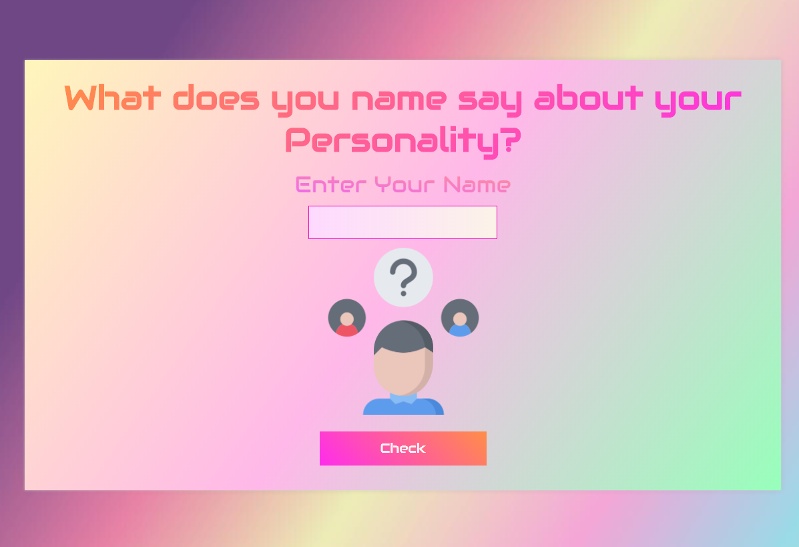

# Personality Teller
 This is a my first ever project using any external **API**.
 

## How it works?
 It is quite a simple project  where we are fetching an Avtar image according to your name and personality by calling an **API**.
 
#### Function
* Every time a user click on check button, it will fetch a new Avtar.
* User will be notified if the input text is empty.

[Live Demo] (https://theleancoderr.github.io/Personality-Teller/)

